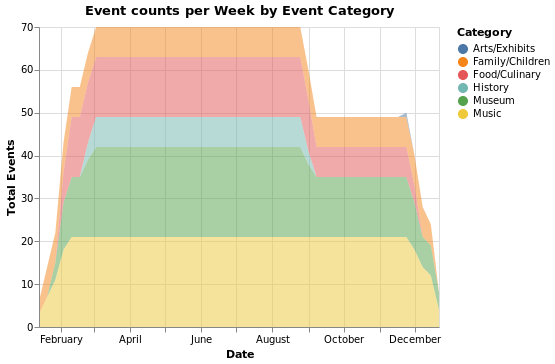
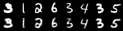

# Data Science Projects

Data Science projects to try out ideas & technologies.

## Notebooks

### Visualization

#### 2019 Toronto Festivals & Events
Exploring 2019 Toronto Festivals & Events data with Altair.
-- [Jupyter Notebook](notebooks/festivals_and_events.ipynb)
- Note: Due to formating inconsistency the location data required significant amount of cleaning.

  
   

- Note: Data is from Toronto Festivals & Events [live feed](https://open.toronto.ca/dataset/festivals-events/), and last updated on July/23/2019 at the time of analysis.

### Machine Learning
#### Variational Autoencoder
Training a Variational Autoencoder from Kingma "Autoencoding Variational Bayes" paper, to generate MNIST digits.
-- [Jupyter Notebook](notebooks/vae_kingma.ipynb)

  
   

